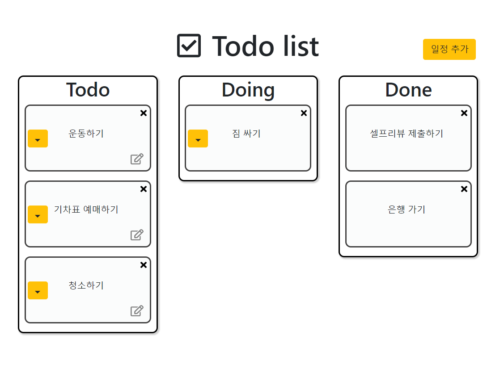

# careerboost_ddingdong
[부스트코스 커리어 부스팅] 허니비즈:띵동 기업 프로젝트 :computer:

### 분야 및 주제
* Web: To-Do List 만들기 (자유 주제)  

### 개발 환경
* Web: JAVA, JavaScript, JQuery, CSS, MongoDB, React, Spring Boot  

### 기업프로젝트 전체 일정 및 프로세스
* 운영 기간: 2019년 9월 10일(화) ~ 2019년 9월 27일(금)
* 기업 피드백: 2019년 9월 23일(월) ~ 2019년 9월 27일(금) - 기업이 선정하여 공지
* 최종 결과물 제출: 2019년 9월 29일(일)
* 최종 결과물: 셀프리뷰(Lessons Learned) 제출하기 + 최종 프로젝트 PR

### 실제 개발 기간
* 2019년 9월 10일(화) ~ 2019년 9월 29일(일)

### 프로젝트 내용
* 화면

* 기능
 1. Todo 추가
 2. Todo 수정 (Todo인 카드만 수정 가능)
 3. Todo 삭제 (Doing, Done 상태의 카드도 삭제 가능)
 4. Todo -> Doing, Doing -> Done 상태 변경
* 시연 영상  
<https://youtu.be/AQKSSh_mrLc>
 

### 가이드 및 유의사항
>1) [부스트코스 에이스 2019: 커리어 부스팅 프로그램 전체 가이드 확인하기](https://docs.google.com/document/d/1-5fw6y2RopqAzfEsQJXjaKib63_7fuqeIdq-ulFzTP8/edit?usp=sharing)  
>2) [기업 프로젝트 가이드 확인하기](https://docs.google.com/presentation/d/1zqfl-b0s_xAmA8JicA7diY5O8NapnZj0XqoPqK0fDZI/edit?usp=sharing)
>3) [Slack 바로가기](boostcourseofficial.slack.com)

